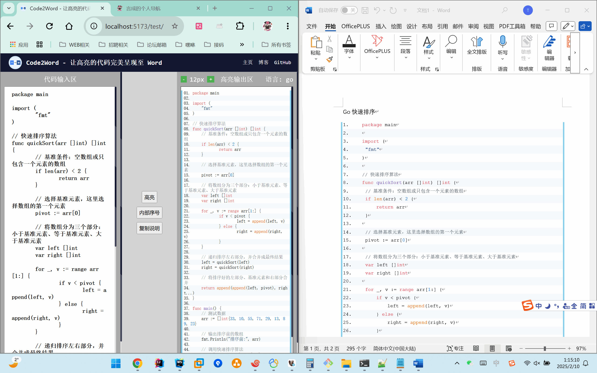

<div style="text-align: center;">
    
    <h1>Code2Word - 让高亮的代码完美呈现至 Word</h1>
</div>


环境

* vue3+vite+pinia
* node16.16.0

[项目](https://github.com/meethigher/code2word)预览图


<div style="text-align: center;">
    
</div>


使用说明

```sh
# 下载代码
git clone https://github.com/meethigher/code2word
# 安装依赖
npm install
# 开发模式
npm run dev
# 打包
npm run build
```

在部署到生产环境时，需要按照实际情况，调整`vite.config.js`中的`base`参数

```js
export default defineConfig({

    // Vite 中 base 配置项的默认值是 /。
    // 这意味着，如果你没有显式设置 base，Vite 会默认将所有静态资源的路径当作相对于网站根目录 / 来处理。
    base: '/test/',
})

```

